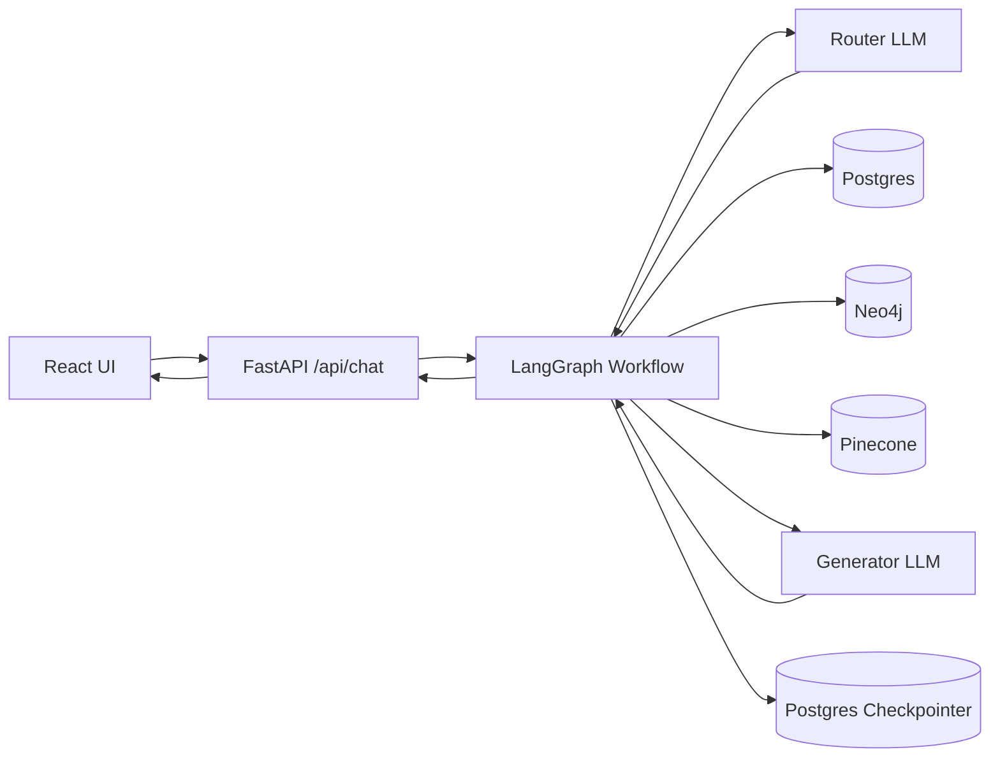
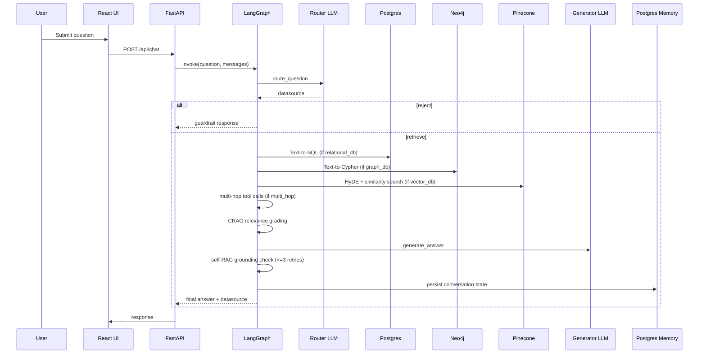

# RosettaRAG

RosettaRAG is an Private Enterprise Retrieval-Augmented Generation (RAG) system for (Hypothetical Organization) Chromatic Prism Corp. It routes questions across relational, graph, and vector data sources, applies relevance grading and hallucination checks, and delivers grounded answers through a modern React UI backed by a FastAPI + LangGraph workflow.

## Features
- **Polyglot routing** across SQL, Neo4j, and Pinecone with structured LLM outputs.
- **Hybrid retrieval** with Text-to-SQL, Text-to-Cypher, and HyDE-based vector search.
- **CRAG relevance grading** to filter weak context before generation.
- **Self-RAG grounding checks** with retry limits to reduce hallucinations.
- **Multi-hop agent** for cross-database questions using tool-based reasoning.
- **Persistent memory** via LangGraph Postgres checkpointer.
- **Guardrail Intercept** which short-circuits the workflow for irrelevant questions.
- **Frontend workflow visualizer** showing routing, retrieval, grading, and generation.

## Use Cases
- HR and payroll queries (salaries, departments, roles).
- Org chart questions (reporting lines, leadership, project ownership).
- Policy lookups (IT, HR, Legal, Finance, Security).
- Project intelligence (status, scope, budget from internal wikis).
- Cross-domain analytics (e.g., combine org structure + budgets + project details).

## Technology Stack
**Backend**
- FastAPI, LangGraph, LangChain
- Gemini LLMs (gemini-2.5-flash / gemini-2.5-flash-lite) + Gemini embeddings (gemini-embedding-2-preview)
- PostgreSQL (Neon) for relational data and conversation memory
- Neo4j for graph relationships
- Pinecone for vector search

**Frontend**
- React, Tailwind CSS, axios

**Data & Ingestion**
- Faker-based synthetic dataset generator

**Deployment**
- Render (Backend)
- Netlify (Frontend)

## Architecture

### Component Diagram

### Sequence Diagram

